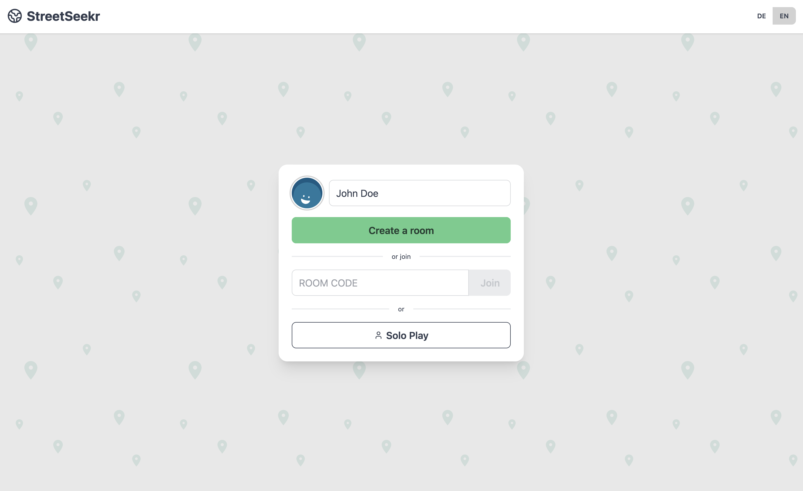
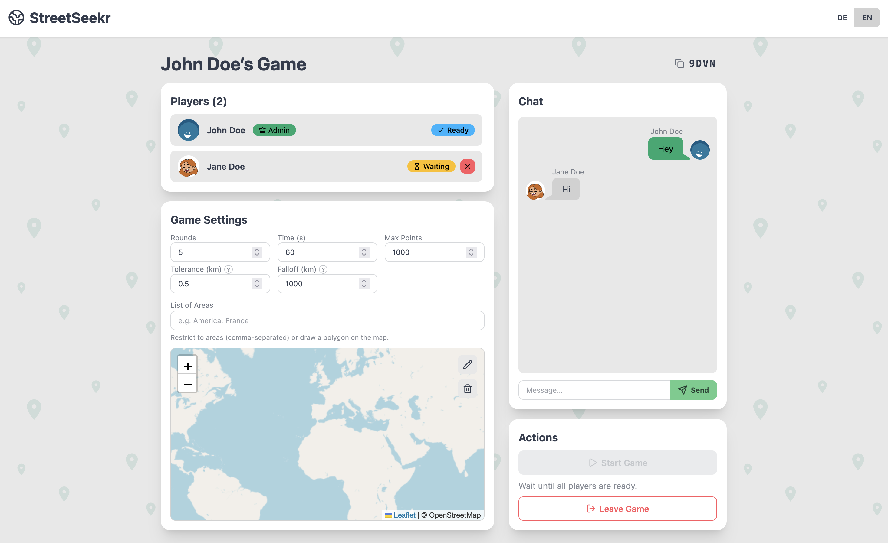
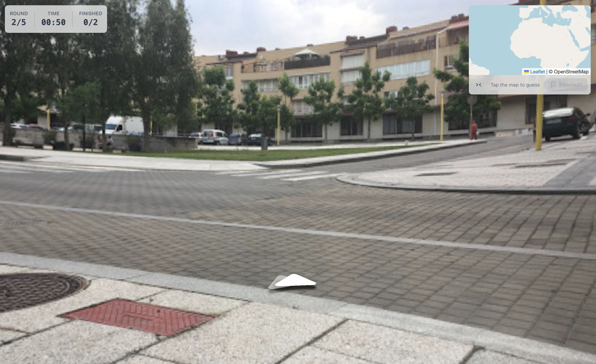
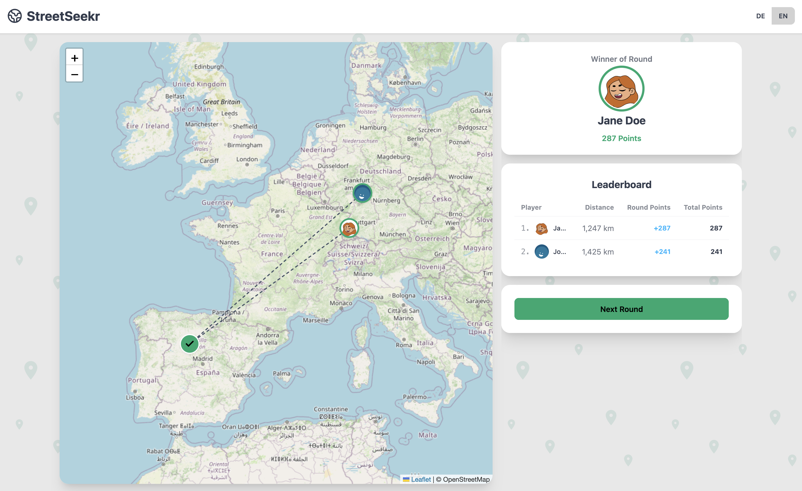

<p align="center">
    
    <br>
    v3.0.0
</p>

# StreetSeekr

StreetSeekr is an open-source alternative to [GeoGuessr](https://www.geoguessr.com/), based on [Panoramax](https://panoramax.fr/). It allows players to explore random street-level images from around the world and guess their locations on a map. The game supports multiple rounds and players, making it a fun and engaging experience. My initial motivation was heavily inspired by [Earthwalker](https://gitlab.com/glatteis/earthwalker).

## 💪 Features

- Create and join multiplayer games with friends
- Explore random street-level images from around the world
- Guess locations on an interactive map
- View scores and rankings after each round

## 🖼️ Impressions

<table>
    <tr>
        <td></td>
        <td></td>
    </tr>
    <tr>
        <td></td>
        <td></td>
    </tr>
</table>

## 📦 Installation

### Prerequisites

1. Docker and Docker Compose installed on your machine.
2. (Optional) A Panoramax API endpoint and viewer URL — by default the federated central instance (`https://api.panoramax.xyz`) is used, so no instance of your own is required.

### Steps

1. Clone the repository:
   ```bash
   git clone https://github.com/doen1el/street_seekr.git
   ```
2. Navigate to the project directory:
   ```bash
   cd street_seekr
   ```
3. Edit the `docker-compose.yml` file to you're needs:

  3.1: Set your Panoramax API endpoint and viewer URL under the `web` service.

   By default StreetSeekr uses the **federated central instance**, which searches across _all_ public Panoramax instances for real worldwide coverage — so you don't need to change anything:

   ```yaml
   environment:
     - PANORAMAX_API_URL=https://api.panoramax.xyz/api
     - PUBLIC_PANORAMAX_VIEWER_URL=https://api.panoramax.xyz
   ```

   To pin a single instance instead (e.g. France-only), point these at it, for example `https://panoramax.ign.fr/api` / `https://panoramax.ign.fr`.

   To query several instances at once, use the CSV plural variables (matched by position):

   ```yaml
   environment:
     - PANORAMAX_API_URLS=https://api.panoramax.xyz/api,https://panoramax.ign.fr/api
     - PUBLIC_PANORAMAX_VIEWER_URLS=https://api.panoramax.xyz,https://panoramax.ign.fr
   ```

   Optional token for private instances:

   ```yaml
   environment:
     - PANORAMAX_API_TOKEN=your_bearer_token
   ```

  3.2 (Optional) Stats and the leaderboard are stored in an embedded SQLite database (`node:sqlite`) — no separate database service is required. The file lives on the `db_data` volume (`STREETSEEKR_DB=/data/streetseekr.db`). To change the host port, edit the `web` service's `ports`:

   ```yaml
   web:
     ports:
       - 'PORT:3000'
   ```

  3.3 (Optional) If you want to change the default domain, you can modify the `ORIGIN` environment variable under the `web` service.

   ```yaml
   environment:
     - ORIGIN=http://yourdomain.com
   ```

4. Start the application using Docker Compose:
   ```bash
   docker-compose up -d --build
   ```
5. Open your web browser and go to `http://localhost:5173` to access the application.

6. (Optional) If you are using a reverse proxy like [Nginx Proxy Manager](https://nginxproxymanager.com/), enable **WebSocket support** (the realtime game runs over a `/ws` endpoint) and, when serving from a different domain, set `STREETSEEKR_ALLOWED_ORIGINS` on the `web` service. Recommended headers:
   ```nginx
    proxy_read_timeout 3600s;
    proxy_send_timeout 3600s;
    send_timeout 3600s;
    client_max_body_size 10m;
   ```

## 🚀 Contributing

You can of course open issues for bugs, feedback, and feature ideas. All suggestions are very welcome :)

## 📜 Credits

- [Panoramax](https://panoramax.fr/)
- [Earthwalker](https://gitlab.com/glatteis/earthwalker)
- [Leaflet](https://github.com/Leaflet)
- [Nominatim](https://nominatim.openstreetmap.org)
- [Svelte](https://svelte.dev/)
- [DaisyUI](https://daisyui.com/)
- [Lucide](https://lucide.dev/)
- [SQLite](https://www.sqlite.org/)
- [ws](https://github.com/websockets/ws)
- [DiceBear](https://www.dicebear.com/)
