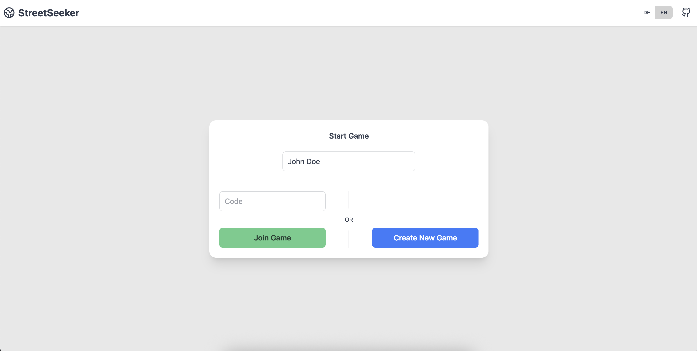

<p align="center">
    
    <br>
    v1.0.2
</p>

# StreetSeekr

StreetSeekr is an open-source alternative to [GeoGuessr](https://www.geoguessr.com/), based on the [Mapillary API](https://www.mapillary.com). It allows players to explore random street-level images from around the world and guess their locations on a map. The game supports multiple rounds and players, making it a fun and engaging experience. My initial motivation was heavily inspired by [Earthwalker](https://gitlab.com/glatteis/earthwalker).

## 💪 Features

- Create and join multiplayer games with friends
- Explore random street-level images from around the world
- Guess locations on an interactive map
- View scores and rankings after each round

## 🖼️ Impressions

<table>
    <tr>
        <td></td>
        <td></td>
    </tr>
    <tr>
        <td></td>
        <td></td>
    </tr>
    <tr>
        <td></td>
        <td></td>
    </tr>
</table>

## 📦 Installation

### Prerequisites

1. Docker and Docker Compose installed on your machine.
2. A Mapillary account and an access token. You can sign up for a free account [here](https://www.mapillary.com/dashboard/developers) and generate an access token [here](www.mapillary.com/dashboard/developers).

### Steps

1. Clone the repository:
   ```bash
   git clone https://github.com/doen1el/street_seekr.git
   ```
2. Navigate to the project directory:
   ```bash
   cd street_seekr
   ```
3. Edit the `docker-compose.yml` file to you're needs:

   3.1: Set your Mapillary access token in the `MAPILLARY_ACCESS_TOKEN` environment variable under the `web` service:

   ```yaml
   environment:
     - MAPILLARY_ACCESS_TOKEN=your_mapillary_access_token
   ```

   3.2 (Optional) If you want to change the default ports, you can modify the `ports` section under the `web` and `pocketbase` services.

   ```yaml
   pocketbase:
       ports:
       - "PORT:8090"
       command: ['serve', '--http=0.0.0.0:PORT', '--auto-migrate']
       healthcheck:
           test: ['CMD', 'wget', '-q', '--spider', 'http://localhost:PORT/api/health']
   web:
       build:
           args:
               - PUBLIC_POCKETBASE_URL: http://localhost:PORT
               POCKETBASE_URL: http://pocketbase:PORT
       environment:
       - POCKETBASE_URL=http://pocketbase:PORT
       ports:
       - "PORT:3000"
   ```

   3.3 (Optional) If you want to change the default domain, you can modify the `ORIGIN` environment variable under the `web` service.

   ```yaml
   environment:
     - ORIGIN=http://yourdomain.com
   ```

4. Start the application using Docker Compose:
   ```bash
   docker-compose up -d --build
   ```
5. Open your web browser and go to `http://localhost:5173` to access the application.

6. (Optional) If you are using a reverse proxy like Nginx, you can set it up to forward requests to the appropriate services. Here is an example configuration:

   ```nginx
    proxy_set_header Upgrade $http_upgrade;
    proxy_set_header Connection "upgrade";
    proxy_http_version 1.1;

    proxy_read_timeout 3600s;
    proxy_send_timeout 3600s;
    send_timeout 3600s;
    proxy_buffering off;

    client_max_body_size 10M;

    proxy_set_header Host $host;
    proxy_set_header X-Real-IP $remote_addr;
    proxy_set_header X-Forwarded-For $proxy_add_x_forwarded_for;
    proxy_set_header X-Forwarded-Proto $scheme;
   ```

## 🚀 Contributing

You can of course open issues for bugs, feedback, and feature ideas. All suggestions are very welcome :)

## 📜 Credits

- [Mapillary API](https://www.mapillary.com)
- [Earthwalker](https://gitlab.com/glatteis/earthwalker)
- [Leaflet](https://github.com/Leaflet)
- [Nominatim](https://nominatim.openstreetmap.org)
- [Svelte](https://svelte.dev/)
- [DaisyUI](https://daisyui.com/)
- [Lucide](https://lucide.dev/)
- [PocketBase](https://pocketbase.io/)
- [DiceBeaer](https://www.dicebear.com/)
